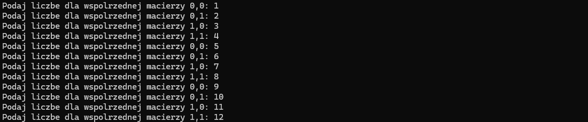
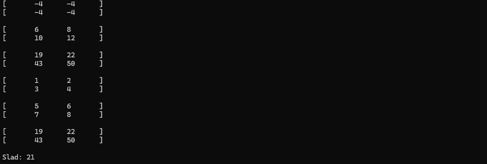
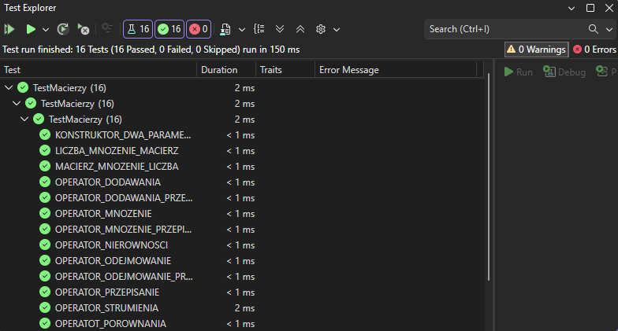

# PROJEKT - OPERACJE NA MACIERZACH

To repozytirum zawiera prosty projekt wykonany przeze mnie na zajęcia: "Programowanie Obiektowe 1", który realizuje kilka podstawowych operacji na macierzach (tj. dodawanie, odejmowanie, mnożenie czy liczenie śladu macierzy). Projekt ten został napisany w C++.

  Poza głównym projektem rozdzielonym na kilka plików, w rozwiązaniu znajduje się również projekt odpowiadający za wykonywanie przykładowych testów jednostkowych dla wspomnianego języka C++.

## Jak odpalić projekt?

Wystarczy ściągnąć cały plik z repozytorium i uruchomić go w programie Visual Studio.
 Pojawi się okienko konsolowe do wpisania wartości dla macierzy i przykładowe wyniki działania programu dla podanych wartości.

## Przykładowe zrzuty ekranu 

* Screen z wpisywania wartości przez użytkownika
 

* Screen z przykładowych wyników operacji w oryginalnej implementacji programu
 

* Screen z wynikami przykładowych testów jednostkowych oryginalnie zaimplementowanych
 